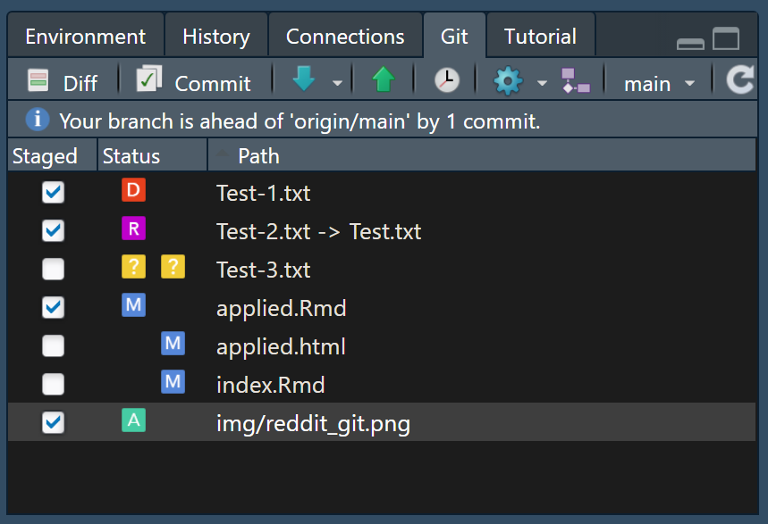

## Projektstart  
Für die Integration von GitHub mit RStudio-Projekten lassen sich zwei generelle Ansätze unterscheiden:  
#### Neues Projekt, gestartet auf GitHub
Die in meinen Augen beste und angenehmste Option, da einem automatisch viel der Setup-Arbeit abgenommen wird.  
- Gehe auf GitHub, drücke auf "+" und erstelle dir ein neues Repository
- Ruf dein erstelltes Repository auf, drück den großen grünen `Code`-Knopf und kopiere dir die dort angezeigte Web-Adresse.  
{width=50%}  

Starte in RStudio ein neues Projekt, aber wähle aus dem Menü `Versionskontrolle -> Git` und gib bei `Repository URL` den eben kopierten Link ein. Ich rate aus Gründen der Organisiertheit zusätzlich dazu, sich einen festen Ordner auszusuchen, in dem alle zukünftigen Projekte gespeichert werden sollen, und diesen unter `Create Project as subdirectory of` anzugeben. RStudio wird sich diesen Ordner merken und für das nächste Projekt bereits standardmäßig ausfüllen.  
Der große Vorteil dieser Reihenfolge ist, dass die ausgewählte GitHub-Repo bereits standardmäßig als `origin` gesehen wird, und lokale Veränderungen den GitHub-Veränderungen folgen. Ohne sich groß mit `Push` und `Pull`-Setup beschäftigen zu müssen, sollte das Projekt nun direkt einsatzbereit sein.  

#### Bereits lokal existierendes Projekt
Hast du ein altes Projekt, das du jetzt mit deinem neu erlangten Wissen über GitHub sichern und/oder teilen willst? Dann ist dies der Schritt für dich.  
Die Grundidee ist dabei die selbe wie bei der erstellung eines neuen Projektes. Wir folgen den oben beschriebenen Schritten, um uns ein neues (leeres) Repo auf GitHub zu stellen, und lokal aus RStudio als neues Projekt anzuwählen.  
Der Kniff hier ist jedoch, dass du nun nach abgeschlossenem Setup des Projektordners einfach dreist hergehen und deine bereits erstellten Dateien über einen Explorer in den eben erstellten Projektordner verschieben kannst. Die Git-Schnittstelle in RStudio wird die hineinkopierten Dateien als neue Inhalte erkennen und eine Synchronisierung ermöglichen.  

## Arbeiten mit Git aus RStudio
Nach dem Start eines Git-Synchronisierten Projektes wird dir vielleicht aufgefallen sein, dass im Environment-Fenster (standardmäßig oben rechts) ein neuer Reiter namens `Git` erschienen ist. Dieses Fenster ist dein bester Freund für das Arbeiten mit Git: Hier kannst du mit nur wenigen Klicks die Arbeit verrichten, die du sonst direkt über Kommandozeilen-Befehle verrichten müsstest. Nicht erschrecken, aber zur Vereinfachung der Erklärung der kommenden Schritte zeige ich dir nun eine Übersichts-Grafik für die grundlegenden Git-Operationen:  
{width=80%}  
Quelle: [Reddit u/stamminator](https://www.reddit.com/r/git/comments/99ul9f/git_workflow_diagram_showcasing_the_role_of/)  
Mehrere der dort beschriebenen `areas` sollten dir bereits bekannt vorkommen. Der `remote branch` ist dein auf GitHub verfügbares Repository, während der `working tree` der klassische Dateibaum auf deinem lokalen PC ist. Die anderen aufgeführten Ebenen sind nun das, was Git so mächtig macht.  
Nimmst du wie bisher eine Änderung an einem deiner R-Skripte (Word-Dokumente, Bilder, ...) vor und speicherst diese aus dem Programm heraus ab, verändert sich nur die lokale Datei, und das (meist) irreversibel. Im Kontext von Git ist jedoch das Speichern von Veränderungen nur eine Änderung innerhalb der `working tree`-Ebene, die in der Repo verfügbaren Dateien verändern sich dagegen nicht.
Nach dem lokalen Abspeichern einer Veränderung solte die betreffende Datei jedoch im Git-Fenster in RStudio erscheinen. Je nach vorgenommener Modifikation sollte dabei ein entsprechend koloriertes Zeichen neben der Datei stehen: ?(neue Datei), A(dded), M(odified), D(eleted) und R(enamed) werden dabei die am häufigsten auftretenden sein. Dieses Git-Fenster in RStudio lässt sich dabei als Pendant zu der in der Grafik angegebenen `index/staging area` sehen. Hier werden Dateien für die Synchronisierung über Git vorbereitet. Was über die Konsole mit dem Befehl `git add` passiert, lässt sich in RStudio durch das Aktivieren des Hakens neben der entsprechenden Datei einfach umsetzen:
{width=50%} 

Für eine gründlichere Beleuchtung der Nutzung von R mit Git und GitHub verweise ich gerne auf: https://happygitwithr.com/index.html  
Bei Fragen und je nach Schwere der auftretenden Probleme kann ich auch im Tutorium zu Helfen versuchen. Ich habe zwar alle hier aufgeführten Schritte auf meiner Maschine getestet, das ist jedoch keine Funktionsgarantie.  