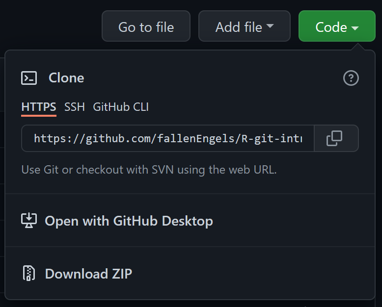

## Projektstart  
Für die Integration von GitHub mit RStudio-Projekten lassen sich drei generelle Ansätze unterscheiden:  
#### Neues Projekt, gestartet auf GitHub
Die in meinen Augen beste und angenehmste Option, da einem automatisch viel der Setup-Arbeit abgenommen wird.  
- Gehe auf GitHub, drücke auf "+" und erstelle dir ein neues Repository
- Ruf dein erstelltes Repository auf, drück den großen grünen `Code`-Knopf und kopiere dir die dort angezeigte Web-Adresse:  
{width=35%}

